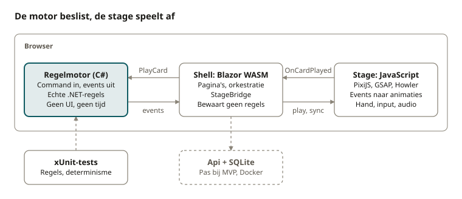

# Architectuur

Hoe het spel technisch in elkaar zit, voor elke afdeling: motor, shell en stage, het eventcontract en de interop. Bewezen in spike 1; de geschiedenis van de spikes staat in [geschiedenis/spikes.md](geschiedenis/spikes.md).

## Platform en techniek

Deck Overflow wordt een website: spelen zonder installatie, op laptop, tablet en (liggend) telefoon.

**Op een telefoon speel je liggend** (sinds 4 oktober 2026). Het gevecht is een vaste wereld van 960×540 die meeschaalt, dus daar verandert niets. De HTML-schermen eromheen krijgen een compacte opmaak met `@media (max-height: 500px)` onderaan `run.css`: een smallere bovenbalk, een liggende map (`MapBoard` tekent beide, de CSS toont er één), een plaat naast de tekst in plaats van erboven. Rechtop op een smal aanraakscherm vraagt het spel om te draaien (`ui.rotate`). Op Android gaat het spel bij de eerste tik naar volledig scherm en liggend (een script in `index.html`, buiten Blazor); op een iPhone kan dat niet, daar zorgt het manifest ervoor dat het spel vanaf het beginscherm zonder browserbalken opent. In de stage zweeft een kaart onder je vinger erboven en groter (`juice.touchHold`), zodat je haar kan lezen.

- **Game-engine:** Blazor WebAssembly voor de regelmotor en de shell, PixiJS voor de stage. Gekozen na zes spikes.
- **Audio:** Web Audio, zodat we toonhoogte per trigger kunnen laten stijgen en geluiden laag op laag kunnen stapelen.
- **Regelmotor:** één centrale motor die C#-semantiek naspeelt (types, afkappen, overflow, voorrang). De game-feel-laag luistert naar zijn events, zodat elke regel automatisch zijn eigen animatie en geluid krijgt.
- **Spelers en accounts:** iedereen mag spelen, ook leerlingen uit het middelbaar. Je speelt meteen als gast en kan later een account met gebruikersnaam en wachtwoord maken om je fabriek te bewaren; e-mail is optioneel. In klassementen staat altijd een gegenereerde bijnaam, nooit wat de speler zelf typte. Geen analytics of tracking. De klascode is optioneel: een docent maakt er een klas mee, zodat klasgenoten elkaar in het klassement zien. Meer doet een docent niet: geen afdelingen vrijgeven, geen dashboard, geen instellingen (beslist op 3 oktober 2026). Details in [wereld/backend.md](wereld/backend.md).
- **LMS-koppeling:** met Moodle-omgevingen zoals Digitap, als latere stap.

**Taal.** Het spel is Engels. Alle spelteksten staan in één bestand per taal, zodat een Nederlandse versie één extra bestand is.

## Motor, shell en stage



De stage meldt een gespeelde kaart, de shell vertaalt die naar een command, de motor geeft events terug en de stage speelt ze af. Alleen de motor kent de regels; de API komt pas bij de MVP.

## Regelmotor

De motor werkt volgens één patroon: een command gaat erin, een lijst events komt eruit. De stage speelt die events af en leest nooit zelf de spelstatus.

```csharp
public sealed class Combat
{
    public static Combat Start(CombatSetup setup, ulong seed) { /* ... */ }

    // Enige manier om de status te wijzigen
    public IReadOnlyList<GameEvent> Handle(ICommand command) { /* ... */ }

    // Alleen-lezen beeld voor de shell: hand, energie, HP
    public CombatSnapshot Snapshot() { /* ... */ }
}

public interface ICommand;
public sealed record PlayCard(int HandIndex, int TargetId) : ICommand;
public sealed record EndTurn : ICommand;
```

### Getypeerde waarden

Elke waarde in het spel draagt een C#-type. De regels per type zijn gewoon .NET-gedrag, geen nabootsing. Daardoor kan de Codex later tonen wat er echt gebeurde.

```csharp
public enum ValueKind { Int, Byte, Double, Bool, String }

public static class ByteRules
{
    public static (byte Result, bool Overflowed) Add(byte current, int amount)
    {
        byte result = unchecked((byte)(current + amount));
        return (result, current + amount > byte.MaxValue);
    }
}

public static class IntRules
{
    public static (int Result, double Lost) Truncate(double incoming)
    {
        int result = (int)incoming;
        return (result, incoming - result);
    }
}
```

### Ontwerpregels voor de motor

- **Deterministisch.** Een eigen RNG met seed (bijvoorbeeld PCG of xorshift), niet `System.Random`, zodat een seed over .NET-versies heen hetzelfde gevecht oplevert.
- **Geen tijd, geen UI.** Geen `DateTime`, geen `Task.Delay`, geen kennis van animatieduur.
- **Elke regel die iets bijzonders doet, meldt het.** Afkappen, overflow en concatenatie krijgen een eigen event. Dat is de haak voor zowel juice als Codex.
- **Events zijn klein en plat.** Ids en getallen, geen objectgrafen, zodat ze goedkoop over de interop gaan.

## Eventcontract

Het eventcontract is de enige afspraak tussen C# en JavaScript. Elk event heeft een `type`, een volgnummer `seq` en platte velden. De stage mag events die ze niet kent negeren, zodat de motor kan groeien zonder de stage te breken.

De events van elke afdeling staan bij die afdeling, bv. [de Card Hall](afdelingen/card-hall/events.md). Een nieuw event komt in die tabel en in de handlers van de stage.

Run-events, die de stage negeert en de shell als melding toont, kwamen erbij met de acts: `ActCompleted` (act) na de baas van een act, en `ActStarted` (act) bij een nieuwe act, die ook een startpunt wordt. Na elk gevecht volgt `CodexUnlocked` (key, values) per regel die erin iets deed: de shell bewaart de pagina met de getallen van dat moment. `XPanelEarned` (key) volgt zodra een command een ✗-paneel verdient, één keer per run; de shell bewaart het over runs heen en toont een melding. `TrinketFound` (key, step) volgt als een kist een onderdeel bevat dat nergens voor dient; de shell steekt het in het zakje.

`IntentView` kreeg een veld `filled`: bij een bewuste intent de expressie met jouw getallen ingevuld (`30 / (5 + 1)`), en `value` is dan wat de aanval nu zou zijn. `AttackLaunched.expression` is bij een bewuste intent de ingevulde vorm.

Zes events kwamen erbij tijdens het bouwen van spike 1, de laatste vier in spike 3. `IntentRevealed.value` is sinds spike 3 leeg als het totaal verborgen blijft (de Rekenmeester). Het patroon bleef hetzelfde: de stage negeert wat ze niet kent.

```json
[
  { "seq": 41, "type": "CardPlayed", "cardId": "herstel", "sourceId": 0, "targetId": 1 },
  { "seq": 42, "type": "ValueOverflowed", "targetId": 1, "before": 250, "added": 6, "after": 0, "max": 255 },
  { "seq": 43, "type": "CombatantDied", "targetId": 1 }
]
```

In C# zijn het `record`-types die met `System.Text.Json` en een type-discriminator naar deze vorm geserialiseerd worden.

## Stage

De stage is een wachtrij die events omzet in animaties, één na één. Zolang de wachtrij speelt, is input geblokkeerd, zodat de speler altijd ziet wat er gebeurt voor hij verder kan.

- **Scene graph (PixiJS):** lagen voor achtergrond, vijanden, speler, hand, effecten en UI-getallen. Elke combatant is een container met sprite, HP-balk en intent-label.
- **Timeline (GSAP):** per event een kleine GSAP-timeline. De wachtrij voegt ze achter elkaar, met overlap waar het mag (een getal kan al oprollen terwijl de shake uitdooft).
- **Juice-presets:** een klein bestand met getallen, zodat de feel afstelbaar is zonder code te lezen.
- **Audio (Howler):** een sprite-bestand met korte geluiden. Toonhoogte via `rate`, die per opeenvolgende trigger in een combo stijgt.
- **Snelle modus:** één factor die alle duurtijden schaalt, behalve hit pause.

```js
// juice.js - startwaarden, af te stellen tijdens de spike
export const juice = {
  hitPauseMs:   { small: 40, medium: 70, large: 120 },
  shakePx:      { small: 2,  medium: 5,  large: 10 },
  rollMsPerUnit: 18,
  comboPitchStep: 0.06,
  overflow: { freezeMs: 350, rollToMaxMs: 600 }
};
```

De concrete getallen zijn vertrekpunten, geen beslissingen: ze worden in de spike op gevoel afgesteld.

## Interop

Per actie van de speler gaat er precies één bericht heen en één terug. De hand en alle kaarten leven in PixiJS, zodat ook hover en sleep-animaties juice krijgen; Blazor ziet alleen het resultaat.

1. **JS → .NET:** de speler speelt een kaart. De stage roept `OnCardPlayed(handIndex, targetId)` aan via een `DotNetObjectReference`.
2. **.NET:** de shell maakt een `PlayCard`-command, geeft het aan de motor en krijgt een lijst events terug.
3. **.NET → JS:** de hele lijst gaat in één keer naar `stage.play(events)`. Die geeft een promise terug die pas klaar is als de laatste animatie gedaan is.
4. **.NET → JS:** daarna stuurt de shell de nieuwe snapshot (hand, energie, HP), zodat de stage synchroon blijft.

```csharp
public sealed class StageBridge(IJSRuntime js) : IAsyncDisposable
{
    private IJSObjectReference? _stage;

    public async Task InitAsync(ElementReference host, DotNetObjectReference<CombatPage> page)
    {
        _stage = await js.InvokeAsync<IJSObjectReference>("import", "./card-hall/stage/stage.js");
        await _stage.InvokeVoidAsync("init", host, page);
    }

    public ValueTask PlayAsync(IReadOnlyList<GameEvent> events) =>
        _stage!.InvokeVoidAsync("play", events);

    public ValueTask SyncAsync(CombatSnapshot snapshot) =>
        _stage!.InvokeVoidAsync("sync", snapshot);

    public async ValueTask DisposeAsync()
    {
        if (_stage is not null) await _stage.DisposeAsync();
    }
}
```

De spike start met `IJSRuntime` omdat dat het eenvoudigst is. Blijkt de overhead toch meetbaar, dan is `[JSImport]`/`[JSExport]` de snellere route; de grens via `StageBridge` maakt die wissel lokaal.

## Risico's en open vragen

Het grootste technische risico is de laadtijd van Blazor WebAssembly op schoollaptops; het grootste ontwerprisico is dat pad B niet ontdekt wordt.

| Risico | Gevolg | Uitwijk |
| --- | --- | --- |
| Blazor-download te groot of te traag | Studenten haken af voor het spel start | Trimming en AOT testen; uiterste uitwijk: motor naar TypeScript porten met dezelfde tests als specificatie |
| Interop-overhead merkbaar | Kaarten voelen stroef | Overstap naar `[JSImport]`/`[JSExport]`, events bundelen |
| Audio start niet | Browsers blokkeren geluid tot de eerste klik | Startscherm met "Speel"-knop die audio ontgrendelt |
| Motor en stage lopen uit sync | Getoonde HP klopt niet | Na elke `play` een `sync` met de snapshot als waarheid |
| Pad B wordt niet ontdekt | Het concept werkt niet zonder hint | Intent of vijandtekst subtiel laten verwijzen naar 255 |

- [ ] Licenties van PixiJS, GSAP en Howler nakijken voor gebruik in onderwijs en eventuele verkoop
- [ ] Placeholder-art en -geluid kiezen (vrije assetpacks of zelf gemaakt)
- [x] Hosting van de spike: GitHub Pages (beslist op 3 oktober 2026)
- [x] Publieke GitHub-repo en Pages-workflow: [timdams/DeckOverflow](https://github.com/timdams/DeckOverflow), gepubliceerd op [timdams.github.io/DeckOverflow](https://timdams.github.io/DeckOverflow/) (3 oktober 2026)
- [ ] Misbruik van gastaccounts: volstaan de limieten van Supabase, of is er een captcha nodig? Een captcha botst met "meteen spelen".
- [ ] Woordenlijsten voor bijnamen samenstellen en nakijken op ongelukkige combinaties
- [ ] Privacyverklaring in eenvoudige taal schrijven
- [ ] Playtesters vastleggen: 5 studenten en 2 collega's
